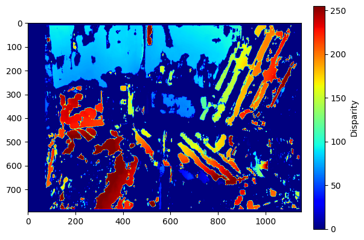

# Stereo Depth Estimation and 3D Reconstruction using MRF

This project implements a **3D reconstruction pipeline** from stereo images using the [Middlebury 2014 Stereo Dataset](https://vision.middlebury.edu/stereo/data/scenes2014/). It includes disparity estimation, depth map generation, and **Markov Random Field (MRF)**-based disparity smoothing to improve robustness against lighting and exposure changes.

---

## 📌 Features

- Stereo disparity estimation using **Sum of Squared Differences (SSD)**
- Support for rectified image pairs with **variable lighting and exposure**
- Post-processing with **Markov Random Field (MRF)** smoothing using [pyGCO](https://github.com/Borda/pyGCO)
- Depth map computation using calibration parameters (focal length & baseline)
- Log-normalized visualizations of disparity and depth maps
- Quantitative visualization of MRF corrections

---

## 🗂️ Dataset

**Middlebury Stereo 2014**  
📁 [https://vision.middlebury.edu/stereo/data/scenes2014/](https://vision.middlebury.edu/stereo/data/scenes2014/)  
Used subset: `Adirondack-perfect`

Each scene includes:
- Rectified image pairs
- Camera calibration file (`calib.txt`)
- Variants with different lighting (`im1L.png`) and exposure (`im1E.png`)

---

## 🧠 Techniques Used

| Component                  | Technique                             |
|---------------------------|----------------------------------------|
| Disparity Estimation      | Block Matching with SSD                |
| Preprocessing             | Gaussian Blur, Histogram Equalization |
| Postprocessing            | MRF Smoothing (via `cut_grid_graph_simple`) |
| Depth Estimation          | Triangulation via focal length & baseline |
| Visualization             | `matplotlib`, `cv2.normalize`, color maps |

---

## 📦 Requirements

Install dependencies via:

```bash
pip install numpy opencv-python matplotlib gco-wrapper
```

Ensure Python ≥ 3.6 is used.

---

## ▶️ How to Run

### 1. Prepare Inputs
- Download the Middlebury dataset.
- Choose two rectified stereo images.
- Place calibration file (`calib.txt`) alongside.

### 2. Run the Pipeline

```python
# Preprocess images
left_img = preprocess_image("im0.png")
right_img = preprocess_image("im1.png")

# Compute disparity
disparity_map = compute_disparity(left_img, right_img, max_disparity=96, window_size=15)

# Read calibration
focal_length, baseline = read_calibration_parameters("calib.txt")

# Generate depth map
depth_map = compute_depth(disparity_map, focal_length, baseline)

# Optional: Apply MRF smoothing
smoothed_disparity = apply_mrf_smoothing(disparity_map, max_disparity)

# Visualize
visualize_depth_map_log(depth_map)
```

---

## 📊 Example Outputs

Example result images are available in the `docs/results` folder:

| Type                      | Example Image                          |
|---------------------------|----------------------------------------|
| Default Disparity         |  |
| Default Depth             |  |
| With Exposure Variation   |  |
| With Lighting Variation   |  |
| MRF Smoothed Disparity    |  |
| Depth Before/After MRF    |  |

---

## 🧪 Evaluation Insights

- Disparity maps degrade with lighting/exposure variation.
- MRF smoothing significantly reduces noise and holes.
- Depth map quality improves noticeably post-MRF.

---

## 📚 References

- **Middlebury Stereo Dataset (2014)**  
  [https://vision.middlebury.edu/stereo/data/scenes2014/](https://vision.middlebury.edu/stereo/data/scenes2014/)

- **pyGCO – Graph Cut Optimization for Python**  
  [https://github.com/Borda/pyGCO](https://github.com/Borda/pyGCO)

- **Block Matching Theory**  
  [OpenCV StereoBM Docs](https://docs.opencv.org/4.x/d9/dba/classcv_1_1StereoBM.html)

---

## © License

This project is developed for educational and research purposes.
